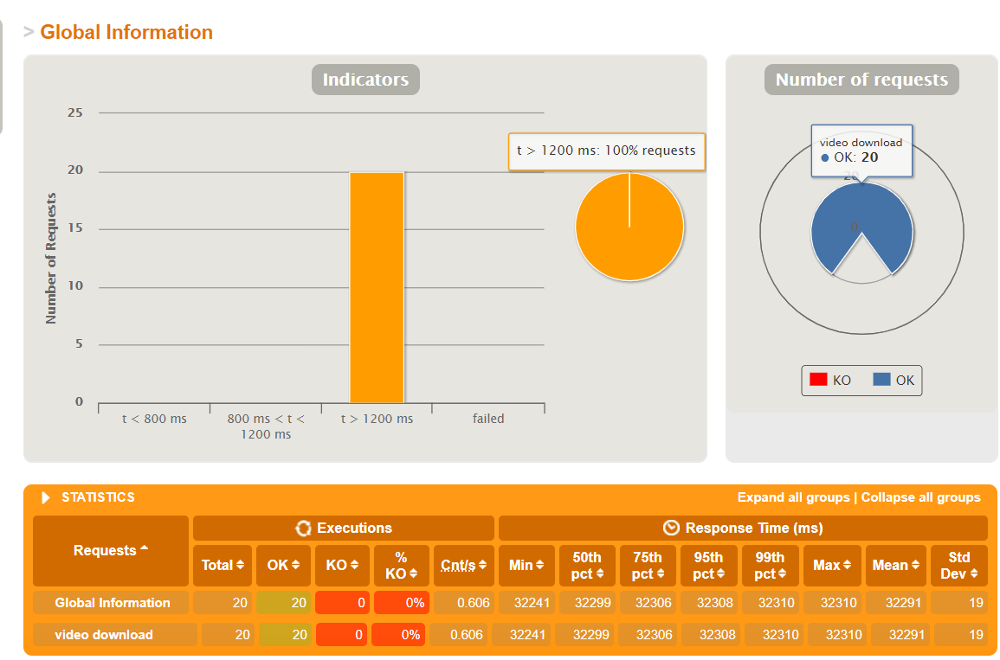
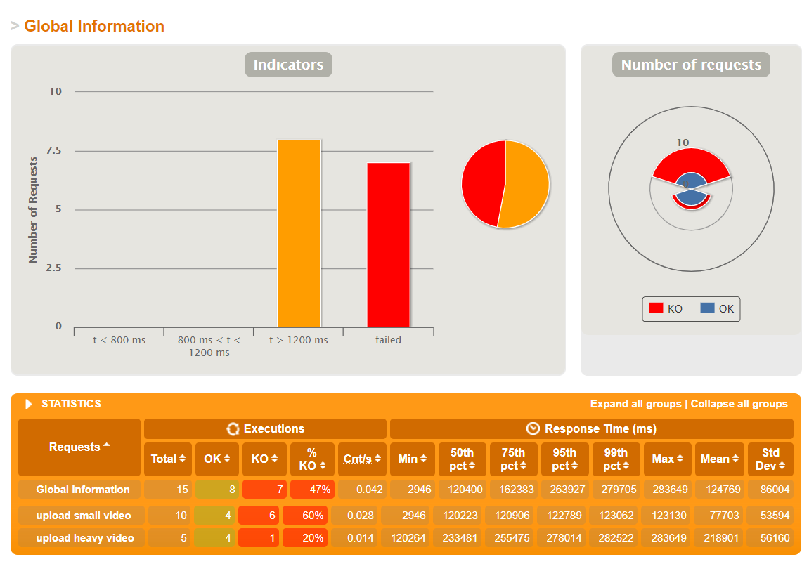

# VideoWebSite


## 项目说明

- 后端：Spring Boot
- 前端：Vue + Element UI
- 视频编码工具：ffmpeg
- 负载均衡：HAProxy
- 消息队列：RabbitMQ
- OSS：MinIO
- 部署：Docker
- 压力测试：Gatling

该项目主要分为两个服务，`backend`下提供视频上传、下载、视频信息列表等基础api，`encode_end`下监听RabbitMQ的消息队列，提供视频编码服务（360p,720p,1080p）

[项目演示](https://www.bilibili.com/video/BV1Qo4y1k7uW/)

### 运行方式

运行`minio`，在`htp://localhost:9293`可访问管理界面

```
docker-compose  -f docker_minio.yml -p minio  up -d --build
```

运行`rabbitmq`，监听15672端口

```
docker run -d -p 5672:5672 -p 15672:15672 --name rabbit rabbitmq:3-management
```

运行`backend`，默认监听8090端口

```shell
cd backend
mvn spring-boot:run
```

运行`encode_end`，默认监听9090端口

```
cd encode_end
mvn spring-boot:run
```

开发环境运行前端，默认监听8080端口

```
npm run dev
```

### 部署方式

```
dockerCompile.cmd # 打包成镜像
dockerRun.cmd	# 运行在8081 8082 8083 8084
```

运行HAProxy，监听8090端口

```
haproxy -f test\haproxy\upload.cfg
```

### 测试方式

gatling测试

下载



上传


